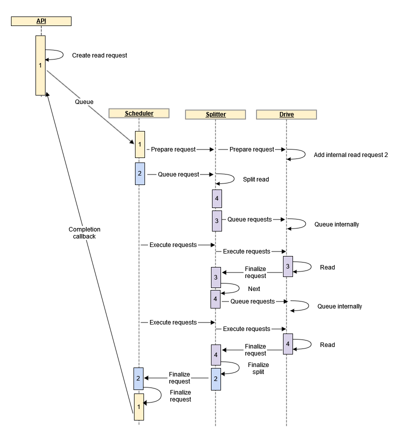

- [Overview](#overview)
- [Configuration](#configuration)
  - [Storage Drive](#storage-drive)
  - [Remote Storage Drive](#remote-storage-drive)
  - [Windows Storage Drive](#windows-storage-drive)
  - [Read Splitter](#read-splitter)
  - [Block Cache](#block-cache)
  - [Dedicated cache](#dedicated-cache)
  - [Full File Decompressor](#full-file-decompressor)
- [API](#api)
- [Request processing](#request-processing)
    - [Read request sequence diagram](#read-request-sequence-diagram)
  - [Scheduling prioritization](#scheduling-prioritization)

Overview
========

AZ::IO::Streamer 2.0 (Streamer from here on out) is a configurable asynchronous file streaming system with the primary purpose to deliver file content as fast as possible. At its core it uses a scheduler to prioritize file requests and a stack of nodes that each server a specific file request operations such as caching, decompressing or reading (information) from storage. Users can configure the stack through the Settings Registry and provide their own nodes through Gems. Streamer provides access through an AZ::Interface to allow other streaming implementations to take its place without requiring engine-wide updates to the code base. Users of the interface will find a simple yet robust set of functions to issue file requests and setup callbacks upon completion of the requests.

Configuration
=============

Streamer comes with a set of nodes that each have their own unique responsibility and can be combined together to provide the exact functionality that's needed in any specific situation and product. These nodes are configured through the Settings Registry by using the configuration describer associated with the node. The extra indirection allows the actual nodes to incorporate hardware specific information without needing to set that up explicitly through the Settings Registry as well. This allows them to react to specific hardware configurations where needed. Below is an example of the configuration for a game using a generic storage drive:

<details>
<summary style="font-weight:bold;">Configuration example</summary>

```json
{
    "Amazon":
    {
        "AzCore":
        {
            "Streamer":
            {
                "UseAllHardware": true,
                "ReportHardware": true,
                "Profiles":
                {
                    "Generic":
                    {
                        "Stack":
                        {
                            "Drive":
                            {
                                "$type": "AZ::IO::StorageDriveConfig",
                                "MaxFileHandles": 32
                            },
                            "Splitter":
                            {
                                "$type": "AZ::IO::ReadSplitterConfig",
                                "BufferSizeMib": 6,
                                "SplitSize": "MaxTransfer",
                                "AdjustOffset": true,
                                "SplitAlignedRequests": false
                            },
                            "Cache":
                            {
                                "$type": "AZ::IO::BlockCacheConfig",
                                "CacheSizeMib": 10,
                                "BlockSize": "MaxTransfer"
                            },
                            "Dedicated cache":
                            {
                                "$type": "AZ::IO::DedicatedCacheConfig",
                                "CacheSizeMib": 2,
                                "BlockSize": "MemoryAlignment",
                                "WriteOnlyEpilog": true
                            },
                            "Decompressor":
                            {
                                "$type": "AZ::IO::FullFileDecompressorConfig",
                                "MaxNumReads": 2,
                                "MaxNumJobs": 2
                            }
                        }
                    }
                }
            }
        }
    }
}
```
</details>
</br>

Note that the declaration is bottom up, meaning that the first option, "Drive" in this case, is the bottom of the streaming stack and will be called last during processing, while "Decompressor" is at the top of the stack and will be called first.

The following global options are provided:

| Name | Type | Functionality |
| --- | --- | --- |
| UseAllHardware | boolean | Whether or not all available storage drives is reported to the configuration nodes. If set to false only storage drives will be reported that match the paths stored in the Settings Registry. During development this option is recommended to be set to true in order allow multiple drives to be accessed. For release products it recommended to be set to false to improve performance as fewer drives would need to be queried as because it removes a vector to hack the game by injecting unexpected drives. |
| ReportHardware | boolean | Whether or not to report all available storage drives and their specs. |

The following nodes are currently available for use with Streamer:

Storage Drive
-------------

A platform neutral drive that can access fixed, external and optical storage drives such as hard disks, usb drives, bluray drives,etc. The implementation makes use of a synchronous platform-neutral file library and meaning it's operations do not make use of OS native asynchronous functionality. This means that Storage Drive has the widest compatibility but does not provide optimal file reading performance and increases the cpu time needed by Streamer.

| Name | Type | Description |
| --- | --- | --- |
| MaxFileHandles | integer | Opening and closing files is expensive so the storage drive node keeps a list of the most recently used ones open. The maximum number of file handles that are kept open can be controlled through this value. Increasing the number allows for faster performance especially when using archives or having frequent partial reads, but may run into OS specific limitations. Flushing specific or all files from the cache will include closing any pending cached file handles. |

Remote Storage Drive
--------------------

With the Remote Storage Drive it's possible to retrieve files from a remote location hosted through the Asset Processor. Similarly to the regular Storage Drive, this node makes use of blocking synchronous calls and thus will not provide performance identical or close to native storage device. The recommended use of the Remote Storage Drive is one devices that don't run locally but need a host machine to process their assets such as Android or iOS mobile device. Using the Remote Storage Drive avoids the need to download builds fully to the device first. Instead files are retrieved from the host machine at the cost of some performance.

| Name | Type | Description |
| --- | --- | --- |
| MaxFileHandles | integer | Opening and closing files is expensive so the remote storage drive node keeps a list of the most recently used ones open. The maximum number of file handles that are kept open can be controlled through this value. Increasing the number allows for faster performance especially when using archives or having frequent partial reads, but may run into OS specific limitations on the host machine. Flushing specific or all files from the cache will include closing any pending cached file handles. |

Windows Storage Drive
---------------------

A Windows specific drive primarily for fixed drives. The implementation makes use of Windows native calls to perform asynchronous file operations to maximize performance and lower cpu requirements. The Windows Storage Drive is not compatible (yet) with all storage drives such as virtual drives, but will work with any standard fixed drive.

| Name | Type | Description |
| --- | --- | --- |
| MaxFileHandles | integer | Opening and closing files in expensive so the Windows storage drive node keeps a list of the most recently used ones open. The maximum number of file handles that are kept open can be controlled through this value. Increasing the number allows for faster performance especially when using archives of having frequent partial reads, but may run into OS specific limitations. Flushing specific or all files from the cache will include closing any pending cached file handles. |
| MaxMetaDataCache | integer | Retrieving file information can be time consuming so the Windows storage drive keeps a list of the most recently retrieved metadata. This option provides a way to set the maximum number of file metadata results to be retained. When running with archives this number can be kept low, otherwise it's recommend to allow for larger number especially if there are many partial file reads. Flushing specific or all files from the cache will include removing any stored metadata in this node. |
| Overcommit | integer | The number of additional slots that will be reported as available. This makes sure that there are always a few requests pending to avoid starvation. An over-commit that is too large can negatively impact the scheduler's ability to re-order requests for optimal read order, while a value that's too small will require the Window storage drive node to wait until the scheduler queues up the next request. A negative value will under-commit and will avoid saturating the IO controller which can be needed if the drive is used by other applications. |
| EnableFileSharing | boolean | Enable the ability to share files that are opened by the Windows storage drive node to be shared with other applications at the same time. |
| EnableUnbufferedReads | boolean | Use unbuffered reads for the fastest possible read speeds by bypassing the Windows file cache. This results in a faster read the first time a file is read, but subsequent reads will possibly be slower as those could have been serviced from the faster OS cache. During development or for games that reread files frequently it's recommended to set this option to false, but generally it's best to be turned on. Enabling unbuffered reads requires hardware dependent alignment for reads, which this node handles internally if not met, but doing so comes at a performance cost and creates memory fluctuations. Other nodes are aware of this alignment as well and can help so adding a Read Splitter and/or Block Cache can help improve performance by allowing this node to avoid dealing with alignment. Further optimizations can be had by having the memory, read request offset and read request size align as well. Information about alignments can be retrieved through Streamer's interface with a call to GetRecommendations(). Note that the Asset Streaming takes the alignments into account. |
| MinimalReporting | boolean | If true, only information that's explicitly requested or issues are reported. If false, status information such as when drives are created and destroyed is reported as well. |

Read Splitter
-------------

The Read Splitter nodes breaks up larger read requests into smaller pieces. There are two scenarios where this is useful.

In the first scenario this can be put in front of a drive that does synchronous operations and can therefor not cancel any active file requests. By splitting up the requests into multiple smaller reads the scheduler can cancel the request as the Read Splitter can prevent non-issued requests from being processed by the drive. This trades some performance for the ability to cancel requests. For this scenario the Read Splitter node is useful when requests are canceled frequently on files larger than the split size.

In the second scenario the Read Splitter node is used to align read requests to a memory boundary commonly needed for drives that use asynchronous operations. Unlike the previous scenario, this requires an internal buffer to store intermediate data, but the buffer will only need to be allocated once. This typically splits the read up in three portions, the unaligned first part, the main part that can be aligned and the unaligned last part. It is possible to have the main part be split up as well, though this generally doesn't have much or any benefit. The benefit of using a Read Splitter instead of letting the drive node take care of alignment is that the Read Splitter will use a fixed buffer, thus doesn't spend time (de)allocating memory and keeps the memory usage stable but this comes at the possible cost of throughput because there are a limited set of requests that fit in the buffer.

It's not recommended to put a Read Splitter node with alignment enabled in front of a cache as it that will typically negate the cache's ability to cache efficiently. It should also be noted that a cache will also do alignment on requests and is preferred as it can reuse already data, but a Read Splitter may still be useful in these cases as not all requests are cached or when a cache has been setup with a configuration that doesn't match the hardware requirements.

| Name | Type | Description |
| --- | --- | --- |
| BufferSizeMib | integer | The total size in megabytes of the internal buffer used to store intermediate data into for aligning requests. This buffer is only needed if "AdjustOffset" is set to true. |
| SplitSize | enum/integer | The maximum requests are split up into in of blocks of this size. The size is provided in bytes. Alternatively two enum values can be used as well:<br><br>*   MaxTransfer - Uses the hardware's largest transfer block, if this information is available. This will align the best with hardware.<br>*   MemoryAlignment - Uses the OS's file system sector size, if this information is available. This aligns best with the OS. This value is typically equal or smaller than the MaxTransfer so use this to conserve memory or allow more parallel read requests, but use MaxTransfer for the ideal size for hardware. |
| AdjustOffset | boolean | If set to true the read splitter will adjust offsets to align to the required size alignment. This should be disabled if the read splitter is front of a cache like the block cache as it would negate the cache's ability to cache data. |
| SplitAlignedRequests | boolean | Whether or not to split reads even if they meet the alignment requirements. This is recommended for devices that can't cancel their requests. |

Block Cache
-----------

The Block Cache node overreads before and after requests and caches the extra data for later use. This is based on the principle that retrieving data from a drive happens in fixed sizes, so the extra data can be read without any extra cost. The block cache is most effective when reading from archives or when there a partial file reads. The least recently used cache entries are removed when new blocks are needed. Flushing specific or all files from the cache will include removing any entries in this cache.

| Name | Type | Description |
| --- | --- | --- |
| CacheSizeMib | integer | The total size in megabytes of the buffer the cache uses to store cache information. The larger this is, the more blocks are available to work with. This will increase how many requests can be run in parallel and how frequently cache entries are removed. |
| BlockSize | enum/integer | The size of an individual block. This can be an integer, in which case it represents the size of the block in bytes or it can be one of the following enum values:<br><br>*   MaxTransfer - Uses the hardware's largest transfer block, if this information is available. This will align the best with hardware.<br>*   MemoryAlignment - Uses the OS's file physical system sector size, if this information is available. This aligns best with the OS. This value is typically equal or smaller than the MaxTransfer so use this to increase the number of blocks or allow more parallel read requests, but use MaxTransfer for the ideal size for hardware.<br>*   SizeAlignment - Uses the OS's file logical system sector size, if this information is available. This aligns with the OS's filesystem. This value is typically equal or smaller than the MemoryAlignment so use this to increase the number of blocks or allow more parallel read requests, but use MemoryAlignment for the ideal size for the OS or the MaxTransfer for the ideal hardware size. |

Dedicated cache
---------------

The Dedicated Cache works largely the same way as the Block Cache, but with the exception that it only considers assigned files for caching. In practice this allows the dedicated cache to keep more blocks in memory than the block cache, but only for specific files. This is useful for files that are periodically revisited such as audio bank or movies. Especially the latter types of files will often read in a linear fashion, but not frequently enough to avoid being removed from a block cache. The dedicated cache can instead guarantee these files stay cached for longer.

| Name | Type | Description |
| --- | --- | --- |
| CacheSizeMib | integer | The total size in megabytes of the buffer the cache uses to store cache information. The larger this is, the more blocks are available to work with. This will increase how many requests can be run in parallel and how frequently cache entries are removed. |
| BlockSize | enum/integer | The size of an individual block. This can be an integer, in which case it represents the size of the block in bytes or it can be one of the following enum values:<br><br>*   MaxTransfer - Uses the hardware's largest transfer block, if this information is available. This will align the best with hardware.<br>*   MemoryAlignment - Uses the OS's file physical system sector size, if this information is available. This aligns best with the OS. This value is typically equal or smaller than the MaxTransfer so use this to increase the number of blocks or allow more parallel read requests, but use MaxTransfer for the ideal size for hardware.<br>*   SizeAlignment - Uses the OS's file logical system sector size, if this information is available. This aligns with the OS's filesystem. This value is typically equal or smaller than the MemoryAlignment so use this to increase the number of blocks or allow more parallel read requests, but use MemoryAlignment for the ideal size for the OS or the MaxTransfer for the ideal hardware size. |
| WriteOnlyEpilog | boolean | If true the dedicate cache node will only store data that's overread after the read request, if false both overreads before and after the read request will be cached. Set this to true for requests that will mostly move forward through a file such as movies. |

Full File Decompressor
----------------------

The Full File Decompressor is responsible for reading and decompressing files from CryPak archives. Due to the limitations of CryPak the Full File Decompressor needs to read the entire file into memory -using later entries in the stack- and then has to decompresses it in a single call. This means that the Full File Decompressor needs to allocate memory for every read with no upper limit to how much memory may be required as this depends on the compressed file size. Decompression happens in parallel using jobs, which allows reads and decompressions to overlap. However because the decompression jobs can be long-running, depending on the file size, a dedicated job system is started for the Full File Decompressor, which will compete with hardware resources such as other threads. It's therefor recommended to balance the number of threads used by the Full File Decompressor with the performance needs of the rest of the engine. Users that target platforms with high speed storage capabilities such as SSD drives are recommended to selective enable compression or have no compression at all. Using archives is still provides better performance even if all files are uncompressed as it will reduce the time spend by the OS retrieving file information and opening/closing files.

| Name | Type | Description |
| --- | --- | --- |
| MaxNumReads | integer | The maximum number of reads that the Full File Decompressor node will have running in parallel. Increasing this value will increase the memory usage by this node, but will also allow more files to be ready for decompression. Decompression is however dependent on the "MaxNumJobs". Typically this will have the same value as "MaxNumJobs", but can be increased in case decompression outpaces reading. |
| MaxNumJobs | integer | The maximum number of decompression jobs that will run simultaneously. Increasing this number will allow more files to be decompressed at the same time, but also uses up more CPU resources. Typically this value will be the same "MaxNumReads" but can be less. It should not be more than "MaxNumReads" as the additional jobs will not be used since not enough files will be read to process them. |

API
===

The Streamer API can be found at the source code link [here](https://github.com/o3de/o3de/blob/5f5dddf46a8a2b6609c2088e70793e89f5ff48dd/Code/Framework/AzCore/AzCore/IO/IStreamer.h#L33-L374)


Most functions within work in three or four steps:

1.  **Create a file request handle.** A single one can be created or a batch of them at a time. Most functions that require a file request handle have a counterpart function that will create a file request handle. These versions are recommended when a single request is know, but performance can be improved if a batch of file handle request can be created at once.
2.  **Add an operation.** There are several operations that can be added, but the most common operation is the "Read" function. This step is not needed if one of the short-hand functions is called in the previous step.
3.  **Add callback.** This optional step adds a callback that will be called upon completion of the request. This callback will come from Streamer's internal processing thread and will block it from processing any other requests until the callback has been completed. It's therefore important to keep the time in the callback as short as possible. Prefer to hand of any long work off to a job in the job system.
4.  **Queue the request.** Requests will not start processing until they are queued. As with creating file request handles, it's preferable for performance to use the batch version if this option is available.

File requests can be used as fire-and-forget calls and they will continue to complete even if the caller is not holding on to the ticket. This however also prevents requesting the status of the request so it's recommended to have a callback function assigned to be able to respond to the request completing. Holding on to the request allows for additional calls to be made on them such as canceling or rescheduling.

Request processing
==================

As soon as a request is queued, the main Streamer thread wakes up and picks up the request. Request first get prepared for processing. This allows nodes to update, expand or add additional requests, such as resolving file paths to archive locations, breaking up a single request in multiple smaller requests, etc. After this has completed the request is internally queued with the scheduler. The scheduler sorts the requests for optimal processing by prioritizing deadline (see next chapter) first and then sorting by optimal read layout. The scheduler periodically probes the node stack for its status and queues new requests from the scheduler queue once there are slots available. Queueing a request on the node stack will have different meanings for each node. For some nodes it can mean doing just-in-time operations such as allocating memory, queue an asynchronous call to the OS or add the request to a list of pending requests for the node. Finally the scheduler will periodically make a call to execute the nodes in the stack, which is similar to a tick function and allows the nodes to do the bulk of their work.

To illustrate the following sequence diagram illustrates a simplified view of how a read request flows through a simple stack that has a splitter and a storage drive.

### Read request sequence diagram



Scheduling prioritization
-------------------------

Streamer used two approaches to scheduling and which one is chosen depends on the deadline that's set for a request. If the scheduler predicts that a request isn't going to make the deadline it's going to move the request to the top of the queue. When multiple requests are at risk of not meeting the deadline, the requests with the higher priority will be sorted higher in the queue than the requests with a lower priority. If there are multiple requests in this case with the same priority than it will be first-come-first-served.

The remaining requests that are not at risk of failing the deadline or don't have a deadline are ordered in a way to get the best performance. This mostly revolves around sorting requests such that files that are close together are read after eachother to maximize cache performance. This typically only applies to archived files, not loose files. If it applies to loose files it means there are multiple requests that do partial file reads which are not recommended. 
