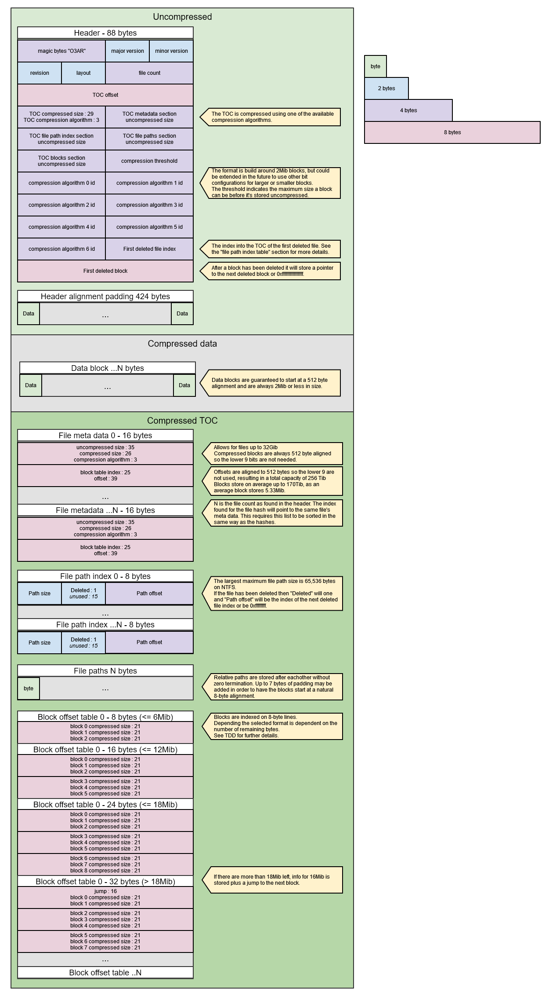
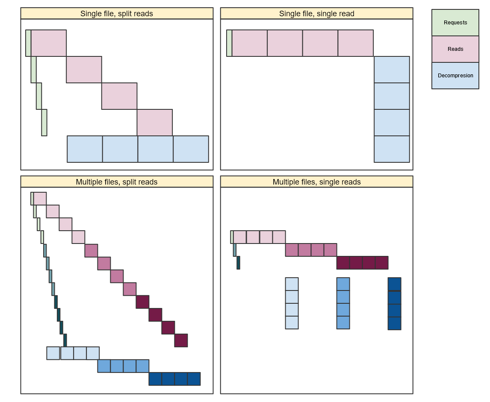
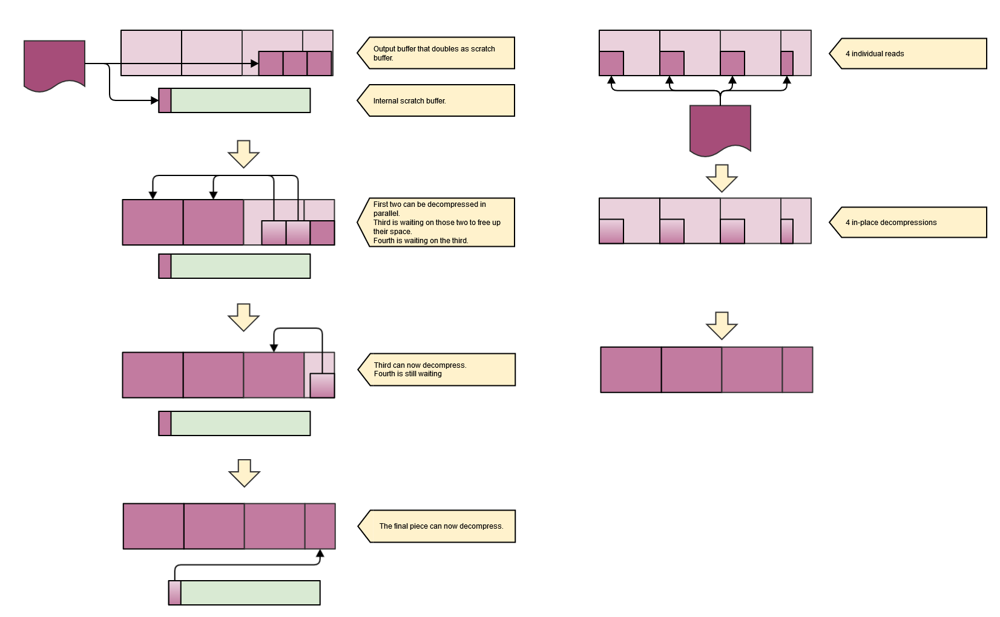

- [Current status](#current-status)
- [Brief summary](#brief-summary)
- [Tenets](#tenets)
- [Stakeholders](#stakeholders)
- [Technical design](#technical-design)
    - [Archive Format](#archive-format)
  - [Archive header](#archive-header)
  - [Table of Content](#table-of-content)
    - [File meta data section](#file-meta-data-section)
    - [File path index table section](#file-path-index-table-section)
    - [File paths section](#file-paths-section)
    - [Block offset table section](#block-offset-table-section)
  - [Blocks](#blocks)
  - [Decompression jobs](#decompression-jobs)
  - [Reading from an archive](#reading-from-an-archive)
    - [Balancing block reading](#balancing-block-reading)
  - [Partial reads from an archive](#partial-reads-from-an-archive)
  - [Scratch memory](#scratch-memory)
  - [Mounting an archive](#mounting-an-archive)
  - [File meta data retrieval](#file-meta-data-retrieval)
  - [Deleting files](#deleting-files)
  - [Code organization](#code-organization)
  - [Tools integration](#tools-integration)
- [Scope](#scope)
- [Testing plan](#testing-plan)
- [Execution plan (And Dependencies)](#execution-plan-and-dependencies)
- [Risks](#risks)
- [FAQ](#faq)
  - [Q: Is it worth to compress files these days?](#q-is-it-worth-to-compress-files-these-days)
  - [Q: Is there a benefit to putting uncompressed files into an archive?](#q-is-there-a-benefit-to-putting-uncompressed-files-into-an-archive)
  - [Q: Why not use Squash to get a whole bunch of compression libraries?](#q-why-not-use-squash-to-get-a-whole-bunch-of-compression-libraries)
  - [Q: Will the next-gen console use this archive format?](#q-will-the-next-gen-console-use-this-archive-format)
  - [Q: Will there be encryption or other security measures?](#q-will-there-be-encryption-or-other-security-measures)
  - [Q: Will the specific bit usage complicate development and other tools?](#q-will-the-specific-bit-usage-complicate-development-and-other-tools)
  - [Q: Will the header and TOC be memory mapped?](#q-will-the-header-and-toc-be-memory-mapped)
  - [Q: Why use 2Mib blocks?](#q-why-use-2mib-blocks)
  - [Q: Why have jumps?](#q-why-have-jumps)
  - [Q: Why 3 block lines per jump?](#q-why-3-block-lines-per-jump)
  - [Q: What alignments are important to get right?](#q-what-alignments-are-important-to-get-right)
  - [Q: Why have a deleted bit in the file path index table entries?](#q-why-have-a-deleted-bit-in-the-file-path-index-table-entries)
  - [Q: How are deleted file metadata entries found?](#q-how-are-deleted-file-metadata-entries-found)
  - [Q: Why not merge the file metadata and file path index?](#q-why-not-merge-the-file-metadata-and-file-path-index)
  - [Q: The scratch buffer can get very big, will that scale?](#q-the-scratch-buffer-can-get-very-big-will-that-scale)
    - [Decompression example](#decompression-example)
  - [Q: What if decompression jobs don't get to run frequently enough?](#q-what-if-decompression-jobs-dont-get-to-run-frequently-enough)
  - [Q: CryPak has more features, why not have parity?](#q-crypak-has-more-features-why-not-have-parity)
  - [Q: What tools will be available?](#q-what-tools-will-be-available)
  - [Q: Data in the archive is also in the Asset Catalog, should the duplicated information be removed?](#q-data-in-the-archive-is-also-in-the-asset-catalog-should-the-duplicated-information-be-removed)
  - [Q: How well will this archive format work with binary patching?](#q-how-well-will-this-archive-format-work-with-binary-patching)
  - [Q: Does the archive support duplicating assets in multiple archives?](#q-does-the-archive-support-duplicating-assets-in-multiple-archives)
  - [Q: Does the archive support duplicating assets within the same archive?](#q-does-the-archive-support-duplicating-assets-within-the-same-archive)
  - [References](#references)

Current status
==============

Approved

Credits: This document was created by [@Infureal](https://github.com/Infurael)

Brief summary
=============

Lumberyard provides an archiving solution called CryPak, which is itself based on zlib. This approach has always had drawbacks when used within a game/simulation context, but has been good enough at the relatively low read speeds provided by HDD and optical drives. With the advance of SSDs, read speeds have rapidly increased where it's no longer nearly-universally true that reading compressed files will accelerate loading times. To illustrate, decompressing a file at 350MB/s and reading at 150MB/s means reads are IO bound, but using a basic 550MB/s SATA SSD means reads are decompression bound and would require increasingly large compression ratios to guarantee that reading an uncompressed file isn't faster. As read speeds for consumer grade PC hardware have reached speeds in excess of 14GB/s, this is a race that can't be won by sticking with the current archive format.

Further complicating the situation is that decompression for CryPak happens on the entire file, which adds unpredictability to the decompression process. This is a particular problem as it prevents decompression from happening in the regular job system as larger files can take too long to decompress and starve the engine of job threads for the rest of the game. With games increasing both the number and the size of files, this problem will only become worse over time.

Lastly CryPak is based on zlib and therefore is limited to supporting zlib and zlib-compatible compression algorithms. Customers finding CryPak slow have looked into using alternatives such as LZMA, [Snappy](https://github.com/google/snappy) or [RAD's Oodle](http://www.radgametools.com/oodle.htm) but there's no clear path on how to integrate those easily into CryPak. The next gen consoles have hardware accelerated decompression, but for that to work they require particular algorithms they provide are used to compress files with, which leaves CryPak unable to be used for these platforms.

The previously mentioned conditions make it difficult to update CryPak to meet the requirements of modern data storage as well as meet customer and vendor demands for a flexible approach towards algorithms. This document proposes a new archive format and a path forward to realizing it. With the new archive format O3DE will have a flexible archive format that has lower resources requirements, better parallelization and better overall performance than CryPak while still outperforming it.

Tenets
======

The following tenets drive the development of the new archive:

1.  **Conserve resources** - The new archive minimizes the need for system resources. The obvious one is reducing the amount of cpu cycles needed, but this also includes memory usage and file I/O. Sometimes this requires balancing resources, like disk space versus file read speeds, in which case the preference should go towards cpu and file I/O even if that means less optimal compression.
2.  **Flexible approaches** - The new archive format should transparently handle different compression algorithms in a way that makes it accessible for customers and/or vendors to add to.
3.  **Maximum parallelism** - While this is an extension of the first point, there will be an emphasis on running work in parallel as much as possible, in particularly making sure that file reading, decompressing and request scheduling all happen in parallel on Windows (other platforms can't run file reading and scheduling in parallel yet, but can decompress in parallel).

Stakeholders
============

**SIG-platform** - Without the ability to use the compression algorithms and tools provided by the platform holders it will not be possible to make use of the hardware accelerated decompression.

**SIG-core (Streaming)** - Streaming in games is currently bottlenecked by decompression. Temporary fixes can be to increase the number of jobs and memory AZ::IO::Streamer is allowed to use, but as the use of streaming increases this will eventually hit a breaking point, in particular because the current solution requires a dedicated job manager.

**SIG-content (asset pipeline)** - The new archive format and tools around these are preferably build from the ground up to interact with the Asset Bundler.

Technical design
================

The new archive format has quite a few details. Before looking into each of these, here's a list of the key technical features for the new archive format:

1.  **Block compression** - Instead of compressing the entire file, the file will divided into blocks with an upper limit of 2Mib. By using this approach the maximum amount of memory that's needed can be limited as well as the maximum amount of time a single decompression job will take.
2.  **Large file support** - The new archive supports a total file size of around 170Tib, with room for up to 33 million files. Individual files can be up to 32Gib.
3.  **Flexible compression algorithms** - Up to 7 different compression algorithms are supported per archive. Each file can pick one algorithm or not be compressed. Individual blocks can either be compressed or uncompressed.
4.  **Alignment and size aware** - For optimal file read speeds it's often needed that the read starts at a specific alignment and a multiple of a particular size is read. On Windows with default NTFS this is for instance 512 bytes for sizes and read sizes are multiples of 2Mib. While this may cause the archives to be slightly bigger, it's preferable due to the improvements in read speeds that can be achieved.
5.  **Streamer only** - In order to make CryPak work with `AZ::IO::Streamer` an EBus had to be used as well as file sharing. To avoid the overhead this brings, the new archive is going to be a part of the streaming stack inside AZ::IO::Streamer. The number of files that don't use Streamer directly or indirectly through the Asset Manager will shrink and ultimately leave only a few files, like config files, that simply won't be added to an archive. _Note that while this is how it will be integrated into stock O3DE, this won't limit a customer from using the archive code elsewhere in O3DE, though it will mean that files read that go through that code path can't be in the same archive as those loaded through Streamer._
6.  **Split header and Table Of Contents** - A fixed size header will stored at the top of the archive while all information needed to retrieve the dynamically sized table of contents will be at the bottom of the file.

The following diagram describes the layout of the archive:

### Archive Format


Archive header
--------------

The archive header describes the content of the archive. When an archive is mounted into the file system the header is fully loaded and kept in memory for fast access to the archive meta data. Data in the header is laid out to match the natural alignment of the data they use to make it possible and performant to map the header directly to structures. For this reason all sections are also 8-byte aligned. The total size of the header is padded to 512 bytes to make sure the data blocks that follow it start at a 512 byte alignment.

The header contains the following fields:

*   **magic bytes** - a 4 character id to uniquely identify the header type. This will always contain the characters "O3AR".
*   **major version** - The major part of the version number. Changes in this number indicate major changes that are not (fully) backwards compatible. 2 bytes are used for a maximum of 65,536 large updates.
*   **minor version** - The minor part of the version number. Changes in this number indicate features have been added and/or expanded. 2 bytes are used for a maximum of 65,536 smaller updates.
*   **revision** - The revision number of the stored version. Changes in this number indicate fixes or optimizations were made. 2 bytes are used for a maximum of 65,536 revisions.
*   **layout**  - Space reserved to allow for different archive configurations. The proposal provides one of several possible configuration, but this may not be ideal for all situations. For instance a high resolution texture pack could result in an archive with only very large files, in which case blocks of 16Mib may be more optimal, or a simpler layout variations is added to support the case where no files are compressed. The initial release of the archive will only support one configuration so this value will always be zero, but 2 bytes are available for a total of 65,536 configurations in the future.
*   **file count** - A 32-bit number indicating the number of files that are in the archive. This allows for storing over 4 billion files, although it should be noted that other restrictions in the format will prevent reaching this number and the actual number will be 33 million or less.
*   **TOC offset** - The offset in bytes from the start of the file to the start of the table of content (TOC).
*   **TOC compressed size : 29** - The compressed size of the table of content. This is the exact size of the table of content on disk. The TOC offset plus the TOC compressed size equal the end of the file or the total file size.
*   **TOC compression algorithm: 3** - The remaining 3 bits are used to indicate what compression algorithm is used to compress the table of content.
*   **TOC metadata index section uncompressed size** - The total size in bytes of the section in the table of content that contains the metadata of the file. The size will be equal to the number of files times the size a metadata block, which is currently 16 bytes.
*   **TOC file path index section uncompressed size** - The total size in bytes of the section in the table of content that contains the file path index table. The size will be equal to the number of files times the size of the file path index entry, which is currently 8 bytes.
*   **TOC file paths section uncompressed size** - The total size in bytes of the section in the table of content that contains the file paths. The size will be variable as each file path string has a variable length, but will including padding to reach an 8-byte alignment.
*   **TOC blocks section uncompressed size** - The total size in bytes of the section in the table of content that contains the block information. The size will be variable as the number of blocks will depend on the size and compression level of the stored file.
*   **compression threshold** - The threshold in bytes after which files are stored uncompressed. Any files that are larger than the threshold will be stored uncompressed. This information can be used to optionally reduce the size of temporary buffers for decompression. This value can not be larger than 2Mib for the current configuration.
*   **compression algorithm 0..6** - The 32-bit ids for the 7 compression algorithms. Every archive supports up to 7 different compression algorithm, with the 8th reserved to indicate an uncompressed file.
*   **First deleted file index** - The index into the TOC of the first file that has been deleted. See the "file path index table" section for further details.
*   **First deleted block** - The offset in bytes from the start of the blocks section of the first deleted block. Each deleted will contain the contain the offset to the next removed block or `0xffffffffffffffff` if it's the final block.

Note that the uncompressed size of the TOC will be equal to the sizes of the individual sections combined together.

Table of Content
----------------

Attached to the end of the archive is a table of content, TOC for short. This holds all the relevant information about individual files needed to find files and decompress them. The table of content is attached at the end of the document as it's guaranteed to change when files are added or removed. If it was stored right after the header this would cause any change to result in the majority archive moving further into the file which makes binary patching slower. Placing the TOC at the end of the archive avoids this problem as only the TOC plus the new data needs to move. An alternative to this would be to not store the header and table of content in a separate file. This would also remove some of the alignment requirements to allow the header to be smaller, but doubles the number of files needed for the archive.

### File meta data section

All information needed to extract and decompress a file from the archive is stored in the file meta data section. After the file is located in the file path table, the index of the path will correspond to the index into this table.

*   **uncompressed size : 35** - The size of the entire file after it has been decompressed. There are no alignment restrictions on this size, so 35 bits are used to support files up to 32Gib.
*   **compressed size : 26** - The total size of the compressed file. This will be the amount of data that needs to be read from disk if the entire file is read. Blocks start at a 512-byte aligned boundary, so the last 9 bits aren't used, which allows for a file size of up to 32Gib to be stored to match the uncompressed size. It's possible that uncompressed files are stored in which case the compressed size can be bigger than the uncompressed size due to the 512-byte alignment. _Note that on file systems files are stored in clusters, so the extra bytes typically don't take up more disk space than the uncompressed file would, though an OS will still typically report it that way._
*   **compression algorithm : 3** - The index of the compression algorithm used to compress the blocks or to indicate the data is uncompressed. The id maps to one of the algorithms declared in the header. If the file is uncompressed than no blocks are used and _block table index_ is ignored. This also means that uncompressed files are stored in one continuous range instead of being split over multiple blocks. 
*   **block table index : 25** - The index of the first block line for the file. This allows for over 33 million block lines. On average 5.33Mib is stored per block line (see _Block offset table section_ for more details) resulting in a capacity to store around 170Tib. This is an average size and less can be stored if there are a lot of small files.
*   **offset : 39** - Offset into the archive where the file starts. Since all entries in the archive have a 512-byte alignment, the last 9 bits can be reused. This allows for an offset of 256Tib, although the actual cap will be around 170Tib as the block table index is the limiting factor.

### File path index table section

The file path index table contains a lookup table into the file paths list that stores the offset into the file paths section where the file path starts and the size of the file path. The largest file path currently available is on NTFS and is 65,536 characters, which can be stored in 16 bits.

*   **Path size : 16** - The total number of UTF-8 characters stored for the file path. The null-terminator is not counted.
*   **Deleted : 1** - If set, then the file entry at the current index is has been deleted. In this case the path offset contains the index of the next file path that has been deleted or `0xffffffff` if it's the final index.
*   **Path offset : 32** - Stores the number of bytes from the start of the file path section to the start of the file path.

Note that the there are 15 unused bytes in each entry. These can be used for a version of Small String Optimization. Reusing the path offset, this would allow for 47 UTF-8 characters to be stored.

### File paths section

The file paths section stores all the relative file paths in one contiguous stream. The file paths are not null-terminated as the size can be retrieved from the file path index table and are not needed as the archive system and AZ::IO::Streamer can use AZStd::string\_view or, if time permits, the latter can be updated to use AZ::IO::PathView. Up to 7 bytes may be added as padding in order to keep an 8-byte alignment.

### Block offset table section

Files are broken down in blocks of 2Mib which require 21 bits to be fully stored. Each 21-bit entry holds the compressed size of the file which is 2Mib or less.

The block offset table uses block lines of 64 bits (8 bytes) which can hold the information for 3 blocks and an used bit. A new block line is added for every 6Mib needed, so a file of 7Mib would require 2 block lines. If more than 3 block lines are needed (so the file is larger than 18Mib) a block will start with a 16 bit jump. A jump provides a way to skip the next group of 8 blocks by providing the total size of the compressed data which avoids the need to read, accumulate and align up each individual compressed size. It's able to do this with only 16 bits because all blocks always start at a 512-byte alignment, so it can effectively encode 16+9=25 bits for a total jump size of 32Mib, though only half of that is practically used. 16-bits are still used to allow for a direct cast to a uint16\_t for faster iterations. To illustrate, a file of 34Mib would require 6 block lines with one jump at the start as 34-16 = 18 so there are no more block lines after the last block so there won't be a jump which can then be used to store the extra block. A file of 36Mib would however have 7 block lines plus 2 jumps in the layout 16 (3 lines with jump)+ 16 (3 lines with jump)+ 4 (1 line).

In rare occasions the entire file compresses down to a smaller file, but an individual compressed block ends up being bigger than the original block in which case the block will be stored uncompressed. This can also happen when a user specifies a compression threshold, such as that the file has to be at least 10% smaller or the uncompressed version should be used. This can be detected in case the block size is exactly 2Mib. In case a file is exactly 2Mib after compression, it's better to store it uncompressed to avoid the time spend on decompression for no benefit.

_The archive supports a large number of files and very large files which can result in a large header as well. This is not expected to be encountered in practice, but if customers do make use of these capabilities the header loading can be updated at that point by only loading portions of the file meta data and/or block offset table._

Blocks
------

As described earlier, the blocks that make up the bulk of the archive will be kept in a separate file from the header. Every block starts on a 512-byte alignment. Uncompressed data is not separated into individual blocks and is stored as a single continuous block. Compressed files are broken into blocks of 2Mib and each block is individually compressed. Users are able to specify a minimal compression percentage and if the block isn't compressed for at least that amount than the block will be stored uncompressed.

Decompression jobs
------------------

Using block compression means that the individual decompression jobs have an upper limit to how long they run. For 2Mib blocks this is roughly 8 milliseconds for an average compression algorithm (see FAQ for more details), which means a single core half (60fps) or a quarter (30fps) of a frame. Compression algorithms that favor decompression speed over compression ratio will require even less time to process. As this is a reasonable duration for a job, decompression can happen using the general job system instead of the specific job system currently used by the full file decompressor. There is still a risk however that the job system gets flooded with requests because larger files and/or a large number of files could generate a burst of jobs on faster hardware. The job system recently got a priority mechanic added that allows jobs to be run at a lower priority, which will be used here to have decompression jobs run at a lower priority as to not interfere with more important tasks such as render jobs. The exception to this is file requests that are in "panic", meaning that they are not likely to complete before their provided deadline and require a boost in priority for the decompression so they have a better chance of completing on time. Commonly, though not exclusively, requests that are in "panic" are file reads with a blocking load and while these should be avoided, they will happen. As these requests will block a thread it's better to get them processed at the highest urgency as they are likely to be a bottleneck.

Reading from an archive
-----------------------

Compressed data will be read into a pre-allocated circular buffer (see Scratch memory for more details) and once loaded by send to one or more jobs to be decompressed.

Issuing read requests is relatively cheap compared to other OS calls, at least on Windows, but they still take time to execute and it's better to avoid issuing too many. To avoid this multiple blocks can be read in a single read, which will include the padding between blocks to meet the 512-byte alignment requirement. _Note that reads should start aligned to the physical sector size which is typically 512 or 4096 bytes._ There may still be a need for multiple smaller reads if for instance there's not enough room in the scratch buffer left or if the end has been reached and reading needs to continue on at the front. This could theoretically be avoid by allocating memory for every read, but this will result in a lot of memory churn and can lead to unpredictable memory spikes, so it's preferred to stick to the available scratch memory as much as possible.

Once a number of blocks are read decompressing can begin by queuing decompression jobs to the general job manager. These jobs take a block in the scratch buffer and the appropriate decompression function and decompress the block to the output buffer at the uncompressed offset for that block. Despite the fact that decompressing should happen as quickly as possible, it's very easy for a large number of decompression jobs to cause other jobs that are more time sensitive, such as render jobs, to not complete in time. To avoid this, decompression jobs will be ran at a lower priority, with one exception. Read request have a deadline and AZ::IO::Streamer's scheduler tries to make sure that requests that are at risk or are already passed the deadline get prioritized. The scheduler will be updated to pass the information about whether or not a read requests is in a "panic" state to the decompressor stack entry which will use this information to queue the decompression jobs at a higher priority. While this won't guarantee that the request will be done in time, it does increase the odds it will. _While efforts are ongoing to remove blocking loads, there are still several of them during this transition period. Especially these read requests would benefit from immediately starting decompression at a high priority._

### Balancing block reading

There is a balance between the number of file reads that should be queued and how much processing is done in parallel. There are also limitations to the number of requests that can be in the queue at any given time and the what the ideal read size is, which all depend on hardware limitations. Reading more blocks in a single read means less time spend on issuing read requests and thus using less cpu time for scheduling, but this also means that a number of blocks become available at the same time so the CPU usage by the decompression jobs becomes "bursty" and has the risk of interfering with other operations or reads running late. Issuing more read requests means decompression can start earlier and be spread out more jobs evenly, but requires more times spend on scheduling and may run into limits to the number of requests that can be issued. The diagram below illustrates the problem, with green representing the time to schedule and issue read requests to the OS, read the blocks being read and blue the blocks being decompressed. (Sizes are idealized and will differ in practice.)

<details>
  <summary style="font-weight: bold">Read/decompress overlap</summary>


</details>
</br>

The first guide to the number of blocks to read is the maximum transfer size of the IO controller, which is the maximum number of bytes an IO controller can transfer in a single operation. To maximize for this the amount of data read per request issued to the OS (which is the compressed size) the size should be at least be equal to or larger than the maximum transfer size. This value is typically 128Kib or 512Kib which will be a single block most of the time, but larger sizes such as 1Mib or 2Mib are also possible, which will more likely require 2 blocks to be read at a time. _Note that there's a possibility of a compressed and uncompressed block needing to be read together, in which case there could be a single read with the uncompressed data memcpy-ed or the read can be split in two. The latter option is likely to work out best as larger transfer sizes seem to be more common on more powerful hardware, but experimentation will need to proof this._ 

The range for the number of IO operations such as reads is quite wide, with the lowest being 31 IOPS and the highest being 32,768 IOPS. On the one hand this could mean that it's preferable to reduce the number of reads, but these lower number are also more common on less capable hardware, which means that the "bursty" decompression will also have a larger impact. The impact for the decompression is likely going to have a bigger impact on the overlap performance on the engine than the additional cost the scheduler is going to take up, so overall it's likely still more beneficial to go for queuing more read requests. _Note that currently the scheduler aggressively works on queuing read requests before processing results, so in reality the decompression in the above diagram wouldn't start until after all the reads having been issued. To get the above balance, especially in the bottom left section, the scheduler will need to be updated to balance between keeping the read requests going and the processing read results. This is complicated between platforms that have async IO implementations and those that don't._

The approach to balancing the number of read requests issued to the OS will be based on trying to match the transfer size by reading as many blocks (based on the compressed size) as are needed to be equal or larger than the transfer size. Users should have global settings to be able to set a minimum and maximum size to fine-tune for specific needs their game has, such as a large number of large files. An added benefit with this approach is that smaller reads are easier to manage memory for (see the Scratch memory section below).  

Partial reads from an archive
-----------------------------

The general recommendation is to always load a file completely instead of partially, but this is not always possible. An example of this is mega-texture files that are compressed, where small portions are continuously read.

Uncompressed files are stored as single continuous range, so seeking within an uncompressed file is achieved by taking the offset from the file meta data and adding the requested offset. Seeking into compressed files is more complicated as every block can end with different compressed sizes. Seeking starts by using the block index to find the first the block line. If the remaining size of the file is more than 18Mib then the block will start with 16 bits used to indicate the total aligned size of the next 8 blocks. This allows the next 2 block lines, which is a total of 8 \* 2Mib = 16Mib, to be skipped and this is repeated until the offset is less than 16Mib. From here the individual blocks are added until the total offset is less or equal to 2Mib. The remainder is the offset into the uncompressed block. A similar process is used to determine the number of blocks to read and what to copy.

<details>
  <summary style="font-weight: bold">Example</summary>

Imagine a file with the following block offset table which has some really good compression:

<style>
td {
  text-align: left;
}

.highlight-yellow {
    background-color: yellow;
}
.highlight-green {
    background-color: green;
}

.highlight-blue {
    background-color: blue;
}
</style>

<table class="fixed-table wrapped"><colgroup><col style="" /><col style="" /><col style="" /></colgroup>
<tbody>
<tr>
<th>Block offset 0 or jump entry</th>
<th>Block offset 1</th>
<th><span>Block offset 2</span></th>
</tr>
<tr>
<td class="highlight-yellow" style="text-align: right;">
Jump : 10 (5120 bytes)</td>
<td class="highlight-yellow">34</td>
<td class="highlight-yellow">86</td></tr>
<tr>
<td class="highlight-yellow" style="text-align: right;">124</td>
<td class="highlight-yellow">516</td>
<td class="highlight-yellow">166</td></tr>
<tr>
<td class="highlight-yellow" style="text-align: right;">180</td>
<td class="highlight-yellow">1048</td>
<td class="highlight-yellow">201</td></tr>
<tr>
<td class="highlight-green" style="text-align: right;">Jump : 12 (6144 bytes)</td>
<td class="highlight-green">2001</td>
<td class="highlight-green">55</td></tr>
<tr>
<td class="highlight-green" style="text-align: right;">789</td>
<td class="highlight-green">221*</td>
<td class="highlight-green">12</td></tr>
<tr>
<td class="highlight-green" style="text-align: right;">68</td>
<td class="highlight-green">514</td>
<td class="highlight-green">18</td></tr>
<tr>
<td class="highlight-blue" style="text-align: right;">6166</td>
<td class="highlight-blue">364</td>
<td class="highlight-blue">44*</td></tr>
<tr>
<td class="highlight-blue" style="text-align: right;">123</td>
<td class="highlight-blue">45</td>
<td><br /></td></tr></tbody></table>

Now a request comes in to read 14Mib starting at an offset of 25Mib. The following steps find the offset for the starting block:

1.  Starting an offset into the archive of 0 and 25Mib left. This is larger than 18Mib so the jump is used by simply casting the first entry of the line to a uint16\_t stored in a uint32\_t and then bit shifted left by 9.
2.  The offset into the archive is now 5120 and the file offset is now 25Mib - 8 \* 2Mib = 9Mib.
    1.  Note that all the block lines are aligned to 512-bytes, so a block that has 34 compressed bytes still takes up 512 bytes in the archive.
3.  Since the 9Mib is less than the 18Mib limit, the blocks are individually inspected. While the offset is larger than 2Mib, add the compressed size (rounded up to multiples of 512) to the archive offset and subtract 2Mib from the offset. This means four blocks will be read. This results in an offset of 5120 (from step 2) + 2048 (rounded up from 2001) + 512 (rounded up from 55) + 1024 (rounded up from 789) + 512 (rounded up from 221) = 9216 bytes.
4.  The remainder is 1Mib, which will need to be used after decompressing to offset into the decompressed file to copy only the second half of the block to the final output.

Next is figuring till where the final block to read is. The total amount of uncompressed data to read is 14Mib.

1.  Starting at the block that was found for the offset, there is 1Mib to read which leaves 13Mib more to be read from the following blocks.
2.  13Mib is larger than what remains in this block group so continue to read forward. This results in an archive offset of 9216 (offset of the start block) + 512 (rounded up from 12) + 512 (rounded up from 68) + 1024 (rounded up from 514) + 512 (rounded up from 18) = 11776 and 13Mib - 4 \* 2Mib = 5Mib left to read.
3.  At this point there is less than 18Mib left in the file so there's no jump at the start of this block group and reading can continue
    1.  archive offset 11776 + 6656 (rounded up from 6166) = 18432, 3Mib left.
    2.  archive offset 18432\+ 512 (rounded up from 364) = 18944 bytes and 1Mib left.
4.  There is now less than a single block left so the next block (44) will need to be read but only 1Mib from it will be copied to the output buffer. This puts the end at 19456 after rounding up the final size.

The range to read will be from the archive will be 9216 till 19456. A total of 8 blocks need to be decompressed, which means at total 16Mib will be decompressed of which 2 \* 1 Mib is unused matching the total requested size of 14Mib. After decompression the first 1Mib of the first block needs to be ignored and only 1Mib needs to be copied from the final block.

</details>

The motivation to include the jump is to allow for faster seeks through large files. The mega-texture in the example can grown to well over 1Gib in size, which would mean a total of 512 additions in order to get to the end of the file. With the jumps in the table this is reduced to 64, making it at least 8 times faster as extra operations such as bit masking and bit shifting to read the individual block sizes is also not needed.

When doing partial reads it's often necessary to decompress an entire block to the scratch buffer first and then copy a smaller portion of it to the final target. This has to be taken into account because an additional one or two 2Mib blocks have to be reserved in the scratch memory for decompression use.

Scratch memory
--------------

As described above, decompressing will require additional scratch memory, While the amount will be configurable by users, there's a theoretical upper limit to the amount that's needed. There's an upper limit to the number of hardware threads a cpu has, which also means there's an upper limit to the number of job threads that can run simultaneous decompression work. For every job there's at least 2 memory chunks needed, one to read to while the other is used to decompress from. These memory chunks should be able to hold the maximum compressed block size, so it's the highest compression threshold of all the archives times 2Mib, although they will need to be rounded up to the physical sector alignment to meet alignment requirements, which typically is between 512 and 4096 bytes. Here are two examples of what these configurations can look like with a 90% compression threshold:

1.  6-core Intel i7 with SATA-SSD: 2 \* AlignUp(1.8Mib, 512) \* 12 = 45,305,856 bytes (~43.2Mib)
2.  64-core AMD threadripper with NVMe: 2 \* (AlignUp(1.8Mib, 4096)) \* 128 = 483,393,536 bytes (461Mib)

Whether the full amount used, especially in the second scenario, is dependent on several factors outside the control of the archive system. Slower compression algorithms require more threads to keep up as does slower cpus. Higher compression ratios would benefit from more threads in order to get the full benefit of the speed gains. Because these factors are variable it's hard to predict the exact number of hardware threads that will be needed and by extension the amount of memory that's actually going to be needed. Further complicating matters is that the above doesn't take into account that additional memory is needed for decompressing files that are partially read. This is limited to the first and last block of the read request, but in the worst case scenario all reads are partial and within a single block so there's a 3rd memory chunk needed for every read, increasing the theoretical upper limits to ~65Mib and 691.5Mib respectively.

O3DE currently doesn't have a mechanic to budget memory, so at any given point it's unclear how much memory AZ::IO::Streamer is allowed to claim. To work around this limitation for now, it will be left up to the user to define an upper limit which can be set through the Settings Registry. It's possible to specialize AZ::IO::Streamer based on available hardware, which can be used to have different memory configurations based on the available hardware. The above equation can be used to determine the maximum scratch memory needed plus some additional memory for partial reads and be capped at the provided limit. This should be a stretch goal however and the initial implementation should simply allocate the amount of memory retrieved from the settings.

Mounting an archive
-------------------

In order to access an archive through AZ::IO::Streamer it needs to first be "mounted". Mounting will cause the stack entry in AZ::IO::Streamer responsible for reading and decompressing files from an archive to load the archive header so the files are known and allow the archive to transparently take part in resolving read requests. To support this, The IStreamer interface will be extended with 3 new functions:

1.  **Mount** - Issues a request to mount an archive. The provided path points to the archive header file. If there's no stack entry to handle this request it's silently ignored.
2.  **Unmount** - Issues a request to unmount a previously mounted archive. The provided path points to the archive header file. If there's no stack entry to handle this request, the archive was never mounted or the archive was already unmounted this request is silently ignored.
3.  **Remount** - Issues a request to unmount and mount an archive in a single operation. If there's not stack entry to handle this request it's silently ignored.

To reduce the amount of code that needs to be touched outside the archive and AZ::IO::Streamer, the tools will be updated to export either a CryPak or new archive version or both. Files known to not be loaded through AZ::IO::Streamer will go into CryPak and the rest into the new archive. Where CryPaks are currently being mounted/unmounted the same path with with a different extension will be send to AZ::IO::Streamer to (un)mount the new archive as well.  

_Note: the mounting calls could theoretically also be used for mounting other pseudo-filesystems such as a specific folders in a drive node._

File meta data retrieval
------------------------

Internally the stack entries in AZ::IO::Streamer need to retrieve meta data information about files. This is currently limited to checking if a file exists and the file size, but could in the future be extended to include other information. These are currently kept internal because support for these requests isn't available from the full file decompressor. Technically it's possible to add the missing functionality, but due to the way CryPak works it requires a few extra checks to happen, increasing the complexity of the implementation, so they weren't added as the new archive project was already greenlit. The side effect of this though is that the IStreamer interface doesn't provide any way to retrieve this information so users need to fall back on the using the synchronous file stack in some situations. Retrieving information like file exists checks and retrieving file sizes can currently be done through by using the Asset Catalog instead but third party libraries may prefer to integrate with AZ::IO::Streamer directly or my want to retrieve file information not available from the Asset Catalog such as time stamps (which would be the time stamp of the archive). Providing this functionality should be considered a stretch goal.

Deleting files
--------------

Files can be deleted during development and after release. In the former case new archives can be created from scratch, but users may want prefer having a limited set of changes to an archive in order to keep patches small. To aid this case the archive format allows marking files as deleted with minimal changes. This means that the data will largely still be there but not reported as available files, producing the smallest amount of changes. When files are updated or added the deleted blocks can be reused to avoid having to append data and the archive continuously growing bigger.

Information about the deleted files and blocks are stored in a single linked list. For both lists the first entry is stored in the header, or the maximum integer version (`0xffffffff` and `0xffffffffffffffff` respectively) is stored to indicate that there are no removed blocks. To find the next deleted file, get the file path index table entry at the index from the header. The entry will have the "deleted" bit set while the next index will be stored in the offset. Keep repeating until 0xffffffff is encountered to get a full list of all deleted files. Finding the deleted blocks works in a similar way. The header will contain the offset relative to the block section of the first deleted block. The first 8-bytes will be overwritten with offset into the next, again relative to the start of the block section, with the remaining data in the block being stale and unused. Note that the blocks are 512-byte aligned so there will always be enough space available to write an offset. This will repeat until the offset found is `0xffffffffffffffff` which will mean the end of the list of deleted blocks.

Code organization
-----------------

The code can follow a similar structure to CryPak, with a single node in the AZ::IO::Streamer and the compression algorithms located in AzFramework, although other configurations such as separate decompression and archive nodes and/or all code in AzCore together with the other AZ::IO::Streamer code are also options. It is however strongly recommended to keep the code to compress data located in AzToolsFramework or other tools-exclusive location in order to keep the runtime as small as possible since the runtime typically won't need to do any compression. The initial release will ship with two compression algorithms, LZ4 and ZLib, with LZ4 being the default compression algorithm. The compression algorithms are stored in a new gem which will have a similar split between decompression available to the runtime and tools and compression only available to the tools. The reason to keep the compression algorithms in a gem is to dogfood the extension model and to allow developers to turn off LZ4 and ZLib for their game if they don't use it. The goal is a single gem with separate binaries for each compression algorithm so they can be individually turned on/off. A stretch goal for this project is to add additional compression algorithms such as ZStandard and/or LZMA.

Configuration of the archive will continue to be done through the Settings Registry, using the streamer.\*.setreg files found in the various Registry folders. The hardware profiles can be used to allocate different memory profiles if needed. (See also [AZ::IO::Streamer 2.0 user guide](./rfc-core-2023-04-20-streaming-archive-files/AZ-IO-Streamer-2.0-User-Guide)) A typical stack for a game could look something like this:


<details>
  <summary style="font-weight:bold;">AZ::IO::Streamer configuration example</summary>

```json
{
    "Amazon"
    {
        "Streamer":
        {
            "Default":
            {
                "Scheduler": {},
                "Stack":
                {
                    "Drive":
                    {
                        "$type" : "AZ::IO::StorageDriveConfig",
                        "maxFileHandles" : 32
                    },
                    "Native drive":
                    {
                        "$type" : "AZ::IO::StorageDrivesWinConfig",
                        "maxFileHandles" : 32,
                        "maxMetaData" : 128,
                        "overCommit" : 8,
                    },
                    "Splitter":
                    {
                        "$type" : "AZ::IO::ReadSplitterConfig",
                        "alwaysSplit" : true
                         
                    },
                    "Remote drive":
                    {
                        "$type" : "AzFramework::IO::RemoteStorageDriveConfig",
                        "maxFileHandles" : 32
                    },
                    "Cache":
                    {
                        "$type" : "AZ::IO::BlockCacheConfig",
                        "cacheSizeMb" : 4,
                        "blockSizeKb" : "auto"
                    },
                    "Decompressor":
                    {
                        "$type" : "AzFramework::Archive::BlockDecompressorConfig",
                        "bufferSizeMb" : 4
                    }
                }
            },
            "NVMe-SSD":
            {
                "Scheduler": {},
                "Stack":
                {
                    "Native drive":
                    {
                        "$type" : "AZ::IO::StorageDrivesWinConfig",
                        "maxFileHandles" : 32,
                        "maxMetaData" : 128,
                        "overCommit" :32,
                    },
                    "Remote drive":
                    {
                        "$type" : "AzFramework::IO::RemoteStorageDriveConfig",
                        "maxFileHandles" : 32
                    },
                    "Cache":
                    {
                        "$type" : "AZ::IO::BlockCacheConfig",
                        "cacheSizeMb" : 32,
                        "blockSizeKb" : "auto"
                    },
                    "Decompressor":
                    {
                        "$type" : "AzFramework::Archive::BlockDecompressorConfig",
                        "bufferSizeMb" : 128
                    }
                }
            }
        }
    }
}
```
</details>

Tools integration
-----------------

The main tool for generating archives will be the Asset Bundler. The Asset Bundler does however view archiving tools, such as CryPak and the new archive as extensions to its main purpose of organizing files, which is why the code for the new archiver will be kept separate and be integrated with the Asset Bundler through the ArchiveCommandBus.

The archiving system, accessed through the ArchiveCommandBus, currently only supports storing CryPaks which are created using 7Zip. Additional arguments will need to be added to allow the bus to forward the compression algorithm (including no compression at all) to use, additional settings for those algorithms take such as the variation and/or compression level and a percentage to indicate the minimal compression that needs to be achieved before switching to uncompressed files.

The Asset Bundler currently doesn't have any way to specify additional settings to pass to the archiver other that the list of files and the path. To be able to store additional compression options the bundle settings will be extended with a set of rules that allow configuring of these options for all files that match the regex or wildcard. To allow overrides on individual files, the same compression options can optionally be added to the asset file info stored in the asset list files. This will also require updates to the Asset Bundler's GUI.

Since CryPak and the new archive will need to live side-by-side for a limited time, the decision what file goes to which archive will be made in the archiving system. The default will be for all files to go into the new archive. If the file extension of a file that will be archived is in the exclude list, stored in the Settings Registry, then that file will go into the CryPak version instead. The exclude list is hardcoded and will be added to during development when new extension are found that require CryPak and extension will be removed over time as the remaining files are moved to being assets.

A stretch goal will be to add a command line tool to allow creating archives separately from the Asset Bundler.

A second stretch goal will be to extend the Asset Bundler's GUI with a file viewer that load and show the content of an archive. When the archive is create, a manifest will be created next to it that contains the information of the files stored in the archive in a humanly readable format which provides the same information, but some customers may still prefer to use a GUI to make navigating large archive easier to do.

Scope
=====

The following is within scope:

1.  A new set of classes to work with the new archive format.
2.  An extension to AZ::IO::Streamer's streaming stack to incorporate decompression from archives into file streaming.
3.  A Gem with 2 compression algorithms (LZ4 and Zlib).
4.  An update to the Asset Bundler compress files and create archives.

The following are stretch goals in no particular order:

1.  Updates to the scheduler. Some smaller updates will be required, but the stretch goal is specifically to improve the performance of the scheduling as it's likely to become the new bottleneck .
2.  Transition from AZStd::string\_view to AZ::IO::Path and AZ::IO::PathView, particular in the IStreamer public interface.
3.  Split up the read splitter into an entry for aligning requests and one to split read requests. The latter won't be needed on Windows and makes for a minor performance improvement.
4.  Reduce scratch memory size. The first implementation can be kept simple by allocating the exact amount of memory indicated by the settings for the scratch memory and this stretch goal can lower it by using the suggested equation. Further reductions can be had by implementing one or both of the alternative loading strategies described in the FAQ below.
5.  Adding additional compression algorithms such as ZStandard and/or LZMA.
6.  Adding a command line tool to access the archive functionality outside Asset Bundler.
7.  Full integration tests (see Testing plan).
8.  Extending the GUI for the Asset Bundler with the new compression settings.
9.  Extending the GUI for the Asset Bundler with the ability to display the file information located in an archive.
10.  Organize files in the archive based on asset dependencies, in order to follow the same order the Asset Streaming will load files. This will improve cache performance inside AZ::IO::Streamer and on hardware.

The following are out of scope:

1.  Continuous archiving and/or always running from archives.
2.  Adding archive support outside AZ::IO::Streamer. (Loose, uncompressed such as the settings registry can still be accessed through plain file IO.)
3.  Any code changes to get more code to use AZ::IO::Streamer directly or indirectly through Asset Streaming.
4.  Removing data that's duplicated between the archive and the Asset Catalog such as file sizes.
5.  Removing CryPak. CryPak is currently still an integral part of the way the levels are stored and loaded.
6.  Standalone operations that can extract files from the new archive; the stream stack entry in the AZ::IO::Streamer will be the only way to read files from the archive for now.
7.  Adding encryption support.

Testing plan
============

The majority of the new code can be covered by unit tests, although some of the unit tests for the runtime part of the archive will need to be next to the compression tests in order to be able to create archives that can be tested with the runtime. The algorithm functions can be mocked to avoid needing a specific gem enabled as well.

There are conformity tests available for AZ::IO::Streamer's stack entries so there are a small number of tests that can be covered with a minimal amount of code.

Testing the compression algorithms will be limited to setting up a set of conformity tests to check if compressing/decompressing works and those conformity tests are hooked up to the algorithms included in the Gem. The compression algorithms themselves will not be tested as it's going to be assumed that these are already well tested before they're used by this project.

Full integration tests are going to require a larger investment as it would require the archiving process to be added. The value is also likely to be limited as it's unlikely to trigger any scenario that isn't more easily tested through unit tests and smaller (unit test sized) integration tests. A better use of time will be to add unit tests for specific edge cases such as reading very small files, dealing with blocks that are larger after compression, etc. as well as add benchmarks to be better able to advise customers on what compression algorithm to use when.

Execution plan (And Dependencies)
=================================

**Phase 1**: The first part to complete is to create 2 EBuses to discover the available compression algorithms. The first ebus is for use at runtime and returns a structure with the meta information about the decompression including a callback to use for decompressing blocks. The second ebus is for tools and returns similar information about compression, including the callback to compress a block and configuration option. Once this is available one engineer can start work on adding the compression algorithms, add the conformity tests and add unit tests to test that the new functionality works. A second engineer can use a mock algorithm to start developing the archive classes for managing, compressing and decompressing archives, again using unit tests to test during development. If the first engineer will be done ahead of the second and is then be blocked waiting for enough progress to be able to start working on Phase 2 several of the stretch goals can be worked on.

**Phase 2**: With the archive classes ready and compression algorithms ready to go, one engineer can start working on the tools to create and compress archives. Focus should first be on getting the Asset Bundler to generate both the new archives and the legacy CryPaks. Once that's done focus should shift to adding the necessary configuration options and unit test. The second engineer's focus will be on adding a new entry to AZ::IO::Streamer's stream stack that will utilize the archive classes to decompress files in a streaming manner.

**Phase 3**: Throughout this TDD several choices were made based on extrapolating previous experiences to recent hardware. Profiling will show where adjustments will need to be made, but running experiments can be time consuming, especially if archives have to be recompressed with different configurations or if benchmarks have to be run on multiple machines. Performance is a key component however as the total amount of data that can be read and decompressed per second should be higher than the amount of time it takes to just read the file (see Risks as well). By dedicating time to this, it will allow room to profile and the necessary incremental changes, especially because the updates that need to happen are likely not limited to the new code. If this time is (not fully) needed then the remainder of the time can be used for the stretch goals. 

Risks
=====

The risks for this project are low. The new archive format can be development next to CryPak and because of the way the stream stack in AZ::IO::Streamer works both CryPak's full file decompressor and the new archive's block decompressor can live in the same stack. If there are unforeseen circumstance that require pausing or canceling this project it will be trivial to remove the new code. This will also mean that pushes to O3DE can be done relatively frequently to avoid large delta's between mainline and the development branch.

There is no indication there are customers that prefer to use CryPak over the new archive format. Should that happen though the solution will be to move CryPak into a separate gem to keep it available for legacy users.

There is currently not a project available that stresses streaming and by extend the new archive format. Artificial situations can be created, but these may not approximate real-world scenarios close enough. Some projects are expected to be developed but these will not focus on streaming and will therefore only incidentally provide test cases for verifying the performance of the new archive. Further complicating this is the fact that not all large assets that commonly stress streaming, such as textures and meshes, have streaming support or streaming support that fully utilizes AZ::IO::Streamer.

Read speeds have increased significantly over the last few years. Where for decades 100-200Mib/s was the maximum read speed, just 5 years ago a SATA-SSD at 550Mib/s was considered high end, while now NVMe drives at 7Gib/s are affordable and the next generation providing 14-16Gib/s. Doing compression used to be less about saving disk space, which is just a nice bonus, but more often about increasing file throughput so more data per second can be read. When competing with 7Gib/s it's easy for small things like a misplaced memcpy to negate the benefits compression brings. This is further complicated by the fact that there aren't many machines available on the high end of the spectrum and security makes it difficult to test external drives efficiently to quickly swap between different types of drives. This would suggest that the simpler solution would be to not compress files, but file sizes have grown so large that compression has become a need again. (See [this article](https://www.pcgamer.com/call-of-duty-modern-warfare-no-longer-fits-on-a-250gb-ssd/) for a real-world example.) That said, even without compression the new archive has several benefits that make it worth while and will provide speed improvements over loose files. To mitigate the risk extra time is being asked for to spend on profiling and optimizing.

The table of content is a variable size structure that grows both the number of files and sizes of files that are added. The intention is for the table of content of each mounted archive to be decompressed and stored fully in-memory for code simplicity and performance. It's therefore important that the table of content doesn't grow too big as it would force users to create finer-grained archives than may naturally fit with their products. The section in the table of content that is likely to grow the quickest is the blocks section. This is because  every 2Mib of data adds one block, adding an additional 21 bits to the archive, meaning that the size of the file impact size of this section and not the number of files. The second section that can grow quickly is the file paths, which will grow with ever file added. Other sections will grown as well with the number of files added but at a fixed rate relative to the number of files. The two sections highlighted should be monitored in particular and if the size becomes too large either optimizations should be made to the file path size (see also the next risk) or alternative options should be provided that allow for larger blocks and thus fewer block entries although this will come at a performance cost.

The design for the archive as proposed in this document does not provide any accelerating structures for finding paths quickly. The plan is to build a hash map at runtime when the archive is loaded. There is a risk that constructing such a hash map at runtime ends up being noticeably expensive in cpu performance while mounting an archive and expensive in terms of memory usage. Both performance aspects needs to be monitored as there's a risk that looking up files becomes more expensive than the time the OS would need to retrieve information for loose files, in which case one of the major benefits of the archive is lost. If the size of the archive and runtime memory usage needs to be reduced, a [trie](https://en.wikipedia.org/wiki/Trie)(-like) structure can be used to remove duplicated segments of a string path and greatly reduce the amount of space the file paths take up. While this would provide a reasonably fast file lookup, it would not be as fast as a hash map. If the focus is on performance, a pre-calculated hash table can be stored in the table of contents, which can provide speeds ups not possible with a standard hash map, based on the assumption that there are no collisions and working with cache lines and SIMD. Hash collisions can be avoided by storing a hash seed and rehashing whenever a collision is found.

FAQ
===

Q: Is it worth to compress files these days?
--------------------------------------------

This is hard to definitively answer that question due to the large range of storage hardware currently available and performance of compression libraries. A standard Intel machine with a SATA-SSD will be able to read 550MB/s, so using LZ4f at 800Mib/s will only need a single core to keep up, but a NVMe-SSD on PCIe4.0 can read 7Gib/s so using zlib at 240Mib/s would require 30 cores to keep up. This gets more complicated because this implies a 1:1 compression ratio, where this is typically higher, so for instance an compression ratio of 3:1 would would mean that 3 times less data is actually read from the drive so in such a situation a 7Gib/s drive would be able to read 21Gib/s of uncompressed data. Practically though the goal is to exceed the upper limit of the drive so more data per second is loaded with compression than without, but that doesn't necessarily mean that the drive speed has to be maxed out. As of the time of writing the number of cores scales with the read speed due to the bus interface setting limitations. a 2Gib/s speed requires at least a PCIe3.0 bus for instance, which limits the processors that typically have enough cores to keep up with the 2Gib/s read speed. This may change over time, which is why uncompressed files are very lightweight in the archive format. This may also not be true for some server configurations where cpu's can run at a lower clock speed than typical desktops. It's also not true for the next-gen consoles which will require storing files "uncompressed" as these platforms have hardware decompression.

Q: Is there a benefit to putting uncompressed files into an archive?
--------------------------------------------------------------------

A: Yes. Reading loose files involves opening the file, then reading the content and eventually closing it. AZ::IO::Streamer caches a small number of file handles for various optimization reasons, so if reads to the same file happen close enough to each other than the file doesn't need to be opened a second time. Opening and closing a file can be quite expensive operations, so are best avoided. By putting all files in an archive, even uncompressed files, the file opening never needs to happen as typically the file handle to the archive will be cached.

Q: Why not use Squash to get a whole bunch of compression libraries?
--------------------------------------------------------------------

A: While Squash itself is MIT licensed and compatible with O3DE, it contains plugins that access GPL licensed libraries which aren't compatible with integration into O3DE itself. Developers typically only use one or two compression libraries, so having to compile and link many additional libraries would simply be overkill and add to code bloat.
The Squash licensing is explained at https://quixdb.github.io/squash/#licensing

Q: Will the next-gen console use this archive format?
-----------------------------------------------------

A: Yes, but with an update. Since the next gen consoles have hardware decompression they won't need to decompress in blocks. To support this they will have a slightly different layout (see also the _layout_ bits in the header) that doesn't have a _block offset table_ and doesn't have a _block table index_ in the file meta data list. The number of bits saved by this are repurposed for alignment requirement on the hardware or can be freely reused for platform specific information.

_Note: at this point it can't be ruled out if fully replacing AZ::IO::Streamer with a potential solution provided by the platform holders will not be a more time efficient solution._

Q: Will there be encryption or other security measures?
-------------------------------------------------------

A: No, This archive format is currently exclusively focused on bundling (un)compressed files together and provide the fastest possible read speeds at runtime. The design however doesn't exclude the option as there's room left in the header for additional data and with the layout option available a version can be provided that has encryption. For this project though it's considered too much additional complexity and risk to tackle a complex problem as encryption as well on top of the other complexities, especially since compression will add another performance concern and additional complexity due to the open-source nature of O3DE.

Q: Will the specific bit usage complicate development and other tools?
----------------------------------------------------------------------

A: The proposed format uses bits in order to keep the size down of the header and the table of contents. Especially the table of contents can grow quite big (the size of the asset catalog can be used as a reference) which is made worse by the fact there can be multiple blocks per file as well. This means larger memory consumption with archives as these two data sections are preferably kept in memory. Smaller data structures will also help with cache efficiency, although that will be a smaller consideration as most of the data in the table of contents will be retrieved from random locations, though it can still have a measurable impact.

Non of the bit fields extend beyond a natural integer type by design. This removes a lot of the typical complexity that come from bit manipulation, such as having to stitch bit together from two integer parts. This allows them to declared in C++ trivially using [bit fields](https://en.cppreference.com/w/cpp/language/bit_field) and rom there on be use in a similar way as regular types. (Note, moving to C++20 would make using bit fields even easier as brace initialization can be used with them.) Other languages like Python may find it more difficult to work with these fields, though not impossible, but this is considered secondary. The archive isn't designed as a generic solution, but rather a solution tailor-made for O3DE and AZ::IO::Streamer in particular. This means development is primarily C++ focused with other languages typically being exposed through an abstraction layer that can access the archive tools through the abstraction layer or can simply call the tools through the command line.

Q: Will the header and TOC be memory mapped?
--------------------------------------------

A: Yes. The idea is to load the header and the table of content directly into memory and then cast the raw pointer directly to C++ structures for further processing. This effectively provides the most minimal processing overhead while mounting an archive. There's also no other data in the header that would require any additional patching such as pointers. Endianness is also not a concern for the current platforms supported by O3DE, but if this were ever going to be a problem than the headers are not complex enough to make doing endian swapping a prohibitively expensive task. Security is also no more or less of a concern with this approach. As stated in the earlier question on encryption, security is kept out of scope for this project. Using a serializer or retrieving fields individually also doesn't change the security concerns as bad data can still be inserted. Security in those cases would come from sanity checking the loaded values, such as that the various sizes are within an expected range.

Q: Why use 2Mib blocks?
-----------------------

A: 2Mib is an educated guess on a good balance between too many decompression jobs and decompression jobs running for too long on one side and on the other side what packs nicely in the archive. A 2Mib block can be decompressed by zlib (assuming 240Mib/s) in 8.33 milliseconds which is typically half or a quarter of the available frame time for a 60fps or 30fps on one core. For LZ4f at 800Mb/s this would be 2.5 milliseconds. These are reasonably sized jobs (though zlib is a bit on the high side still) as to not flood the job system with micro tasks, but also have tasks that can be done within a frame and leave room for other tasks to be scheduled.

On the other end dividing 64 bits up in 4 would have 16 bits per block, so 64Kib files. Dividing in 2 would be 32 bits per block so 4Gib. 4Gib is too big for sure while 64Kib used to be the preferred size a decade ago but both read speeds and cpu speeds have made this too fine-grained. When dividing 64 bits in 3, 21 bits or 2Mib is the ideal size (though this still remains to be empirically proven).

Q: Why have jumps?
------------------

A: Practical experience from working with streaming mega-textures showed that the lack of a jump table was a large performance cost. The start of a map would see significantly better streaming performance then the opposite end of the map, which led to the development of the jump list. That said it was also based on different hardware and different block sizes and the bigger block sizes and the increase in cpu power may largely negate the need for jump tables. It may even turn out that the relatively few cases jump tables are needed due to partial file reads on large files and the extra code needed to support turns out to be a negative impact. That said, not having it and needing it is a bigger problem than not needing it and still having it, so it should be a baseline feature. If it turns out the overhead is too large for archives that never use the jump table then a slightly different layout (see _layout_ in the header) can be added that turns of jumps all together. Adding a second layout like this is a good stretch goal.

Q: Why 3 block lines per jump?
------------------------------

A: The choice to pick 3 block lines is again an educated guess based on previous experience. The idea being that 1-4Mib mega texture blocks would today be add double the resolution so 4-16Mib, which fit nicely in 3 block lines. As more high level streaming work is done in the future, practical examples of large files such as single terrain textures or sub-divided mega-models will guide to more specific sizes. There's room to add another 3 lines with minimal code changes and there's room to increase the size of the jump to 22 bits to further increase the number of available lines. On the other end of the spectrum it's equally easy to remove the jumps all together and in fact the previous question suggests a stretch goal to do this for other reasons.

Q: What alignments are important to get right?
----------------------------------------------

A: Most platforms currently don't have any alignment requirements due to not having native file IO implementations of AZ::IO::Streamer's drive node, though this will be changing in the future. Windows however has strict alignment requirements that differ based on available hardware and file system configuration. The relevant information is collected the StreamStackPreferences and can be passed to individual stack entries. The important ones are the logical and physical sector sizes. The former is given by the file system but is typically 512 bytes. All offsets and read sizes need to be a multiple of the logical sector size. The latter is a requirement given by the hardware and ranges from 512 bytes to 4096 bytes. Any memory being read to needs to be aligned to a multiple of the physical sector size. AZ::IO::Streamer has several ways to deal with alignment issues, so if the new stack entry that deals with decompression has any issues it won't cause crashes, but will result in performance hits and/or memory spikes.

Q: Why have a deleted bit in the file path index table entries?
---------------------------------------------------------------

A: Strictly speaking this isn't needed, but will help with debugging. The path offset indicates two different kinds of values: one is an offset into the string table and the other the index of the next deleted file. These values can look similar but mean different things so keeping a bit local to indicate the intention instead of having to walk a linked list can greatly help debug issues. If the bit is however needed, for instance to have an additional character in the Small String Optimization buffer then it can be used for that. In theory it can also be used at runtime to filter out whether or not a file path should be compared or not, but it's recommended to remove any deleted file paths from any accelerating structures like a hash map upon the creation of the hash map, which can also be done with the linked list.

Q: How are deleted file metadata entries found?
-----------------------------------------------

A: The file metadata entries share the same position with the file path index entries. When the index of a deleted path is found in the file path index table, the same index can be used to find the matching deleted file metadata entry.

Q: Why not merge the file metadata and file path index?
-------------------------------------------------------

A: Data is organized in a way they're most likely to be used and it's expected to be common for the the file path index to be used separate from the file metadata. The file path index will be searched to locate the index of the file, which is then used to index file metadata directly. Splitting the data has therefore a slightly better cache performance. Another reason is that the file path index table could be converted into an acceleration structure at runtime such as a hash map. This could lead to duplicated data, but by keeping the file path index separate, room is created for that section to be freed from memory.

Q: The scratch buffer can get very big, will that scale?
--------------------------------------------------------

A: The size of the scratch buffer is determined by the number of jobs that can and need to be run to outpace the raw read speed. This simply means that slower compression algorithms, faster hardware and more threads will all increase the required memory size. The last two factors will continue to grow over time and are beyond our control. For the compression algorithms we can continue to explore better and faster algorithms and dissuade users from using slower ones. The approach taken favors speed over memory as there are concerns that not taking an approach that favors performance, decompression won't be able to keep up with the higher read speeds. If performance (after optimizations) proofs to be good enough there are two approaches that can be added that will allow for lower memory needs add the cost of some performance. Both approaches use the target buffer as scratch memory so can not be used for memory that's write-only. The additional approaches should be offered as configuration options so users can select the approach that best fits their use case:

1.  Write all but the last block to the target buffer and the last block to scratch memory. This allows decompressing the first blocks in parallel, but the later blocks can't be decompressed until the first blocks have completed as the compressed data would otherwise be overwritten too soon. This leads to reduction in parallelism, which may be ok if there are a large number of files being read simultaneously, but individual files would load slower.
2.  Some compression algorithms support in-place decompression. For those algorithms all the individual blocks can be read add 2Mib increments in the target buffer and then decompressed individually. This would mean no scratch memory is needed at all, but typically in-place decompression is slower and it would require more OS calls.

<details>
  <summary style="font-weight: bold">Alternative loading approaches</summary>

### Decompression example

</details>
<br/>

Q: What if decompression jobs don't get to run frequently enough?
-----------------------------------------------------------------

A: The utilization of the job system is currently on the low side, so this is not likely going to be an immediate problem. Over time though, as more code gets "jobified" it may start to impact the decompression jobs. The most direct way to solving this is to have one or more job threads with an inversed priority, which is to say that those job threads preference running low priority job over normal priority jobs unless there's a high priority job. If that's not enough than AZ::IO::Streamer can become more aggressive about increasing the priority. This could take the form of bumping the priority not just for "panic" reads but for read requests that are X milliseconds away from reaching a "panic" state. X could be automatically adjusted at runtime using the already existing metric about the number of jobs that are on time or not.

Q: CryPak has more features, why not have parity?
-------------------------------------------------

A: CryPak has indeed additional features, but these features often require additional processing and memory and increase the amount of code to maintain. These features are not used in O3DE and there are no plans to support them in the future, so parity would not add any customer value so the cost of performance and development is therefore better directed at features that are needed and making those as good as possible. Should additional features be needed in the future it's possible to add these and update the version number in the archive format for backwards compatibility.

Q: What tools will be available?
--------------------------------

A: O3DE currently already provides a tool to create archives called the Asset Bundler. This tool currently wraps around the CryPak libraries but these would be updated to use the new archive libraries. For ease-of-use customers have asked to have the option to generate a manifest to go along with the archive that lists the files in the archive and additional information such as file sizes. Since this will be offered in the initial version there's less emphasis on creating viewers, although those can still be part of the project as a stretch goal. The Asset Bundler has a GUI which could be extended to show archive content.

Q: Data in the archive is also in the Asset Catalog, should the duplicated information be removed?
--------------------------------------------------------------------------------------------------

A: Eventually, yes, but for now it's fine to have both sets of data. The amount of data is limited to file sizes and file paths, so removing the duplicated data will eventually be beneficial. One of the benefits the archives have over the Asset Catalog is that they can be split over multiple files that don't necessarily have to all be loaded, which allows for further memory savings, but to benefit from this archives would need to be perpetually created, similar to how the Asset Catalog is currently constantly rebuild.

Q: How well will this archive format work with binary patching?
---------------------------------------------------------------

A: The proposed format allows files to be appended and only requires in-place changes in the header and moving the table of content at the end which has to be updated regardless. Removing files will depend on where the file is removed, but again may not require the entire archive to be moved. This generally makes it produce smaller binary patches than a naïve approach. Due to the required padding there's also some room for smaller changes to existing files to happen in place. Much however depends on using a good binary diffing/patching algorithm and making sure that the archiving tools make updates in a way that work well with binary patching.

Q: Does the archive support duplicating assets in multiple archives?
--------------------------------------------------------------------

A: Yes, but it won't use that information in scheduling. Instead it will use the first archive it finds that contains the file. This means that archives can act as patches over other archives, just as long as the archives are mounted in the correct order.

Q: Does the archive support duplicating assets within the same archive?
-----------------------------------------------------------------------

A: No. This was a common approach with optical storage to reduce file seeks for common files and the extra size didn't matter when staying within the storage media's fixed upper limits. Optical drives are rarely, if ever, directly accessed anymore these days so the focus has been reduced to fixed storage drives. This could see some very minor benefit in loading speeds due to improving cache efficiency, but it will be difficult to get the additional logic required to support this feature to not loose out on the minor benefit or even ending up being too expensive on average. This is because file duplication will increase the complexity in finding and scheduling the most optimal version to load. It's also unlikely customers will want to increase the size of their archives for minor to trivial performance gains.

References
----------

*   [AZ::IO::Streamer 2.0 User Guide](./rfc-core-2023-04-20-streaming-archive-files/AZ-IO-Streamer-2.0-User-Guide)
*   [https://quixdb.github.io/squash-benchmark/#results-table](https://quixdb.github.io/squash-benchmark/#results-table)
*   [https://github.com/inikep/lzbench](https://github.com/inikep/lzbench)
